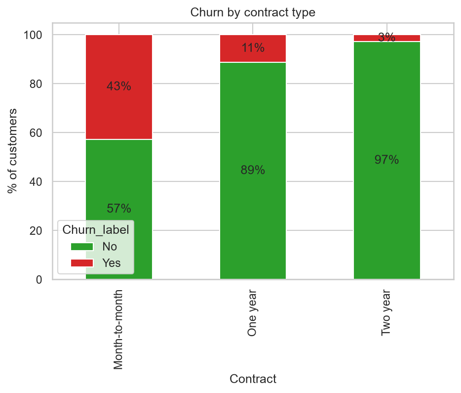
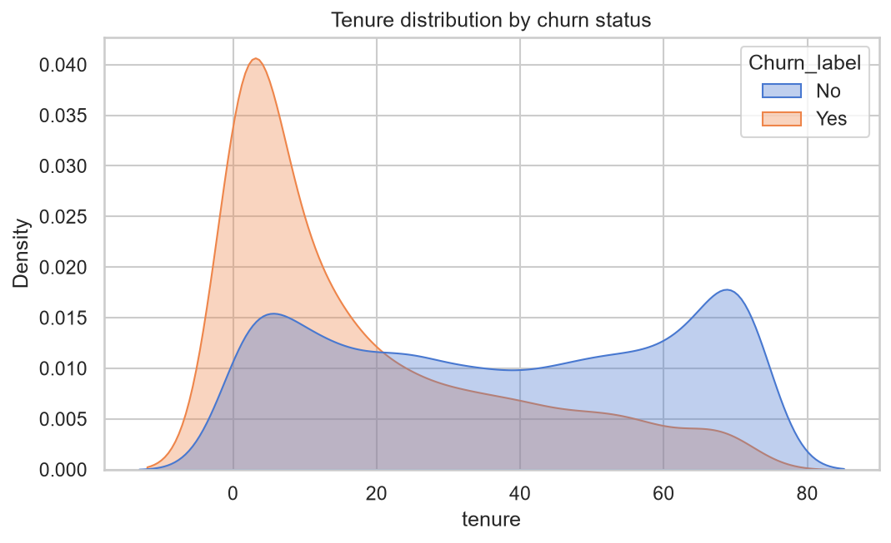
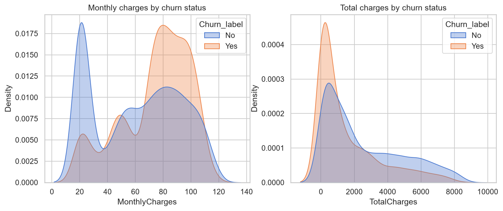
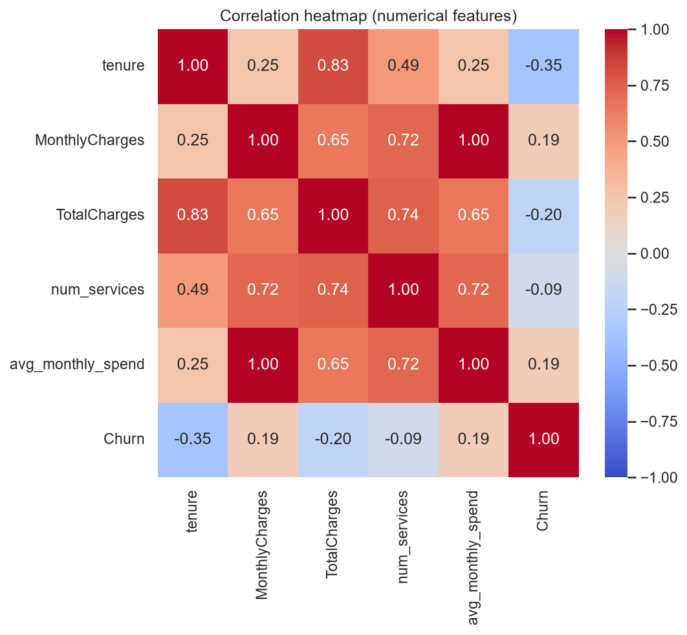
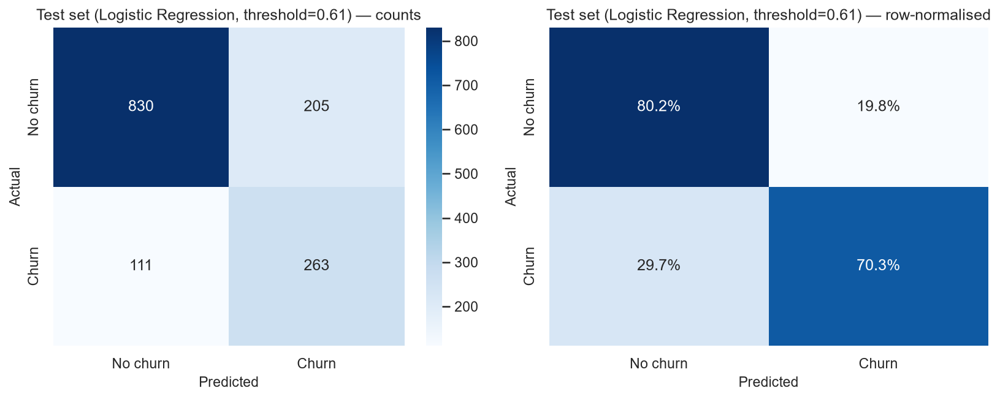
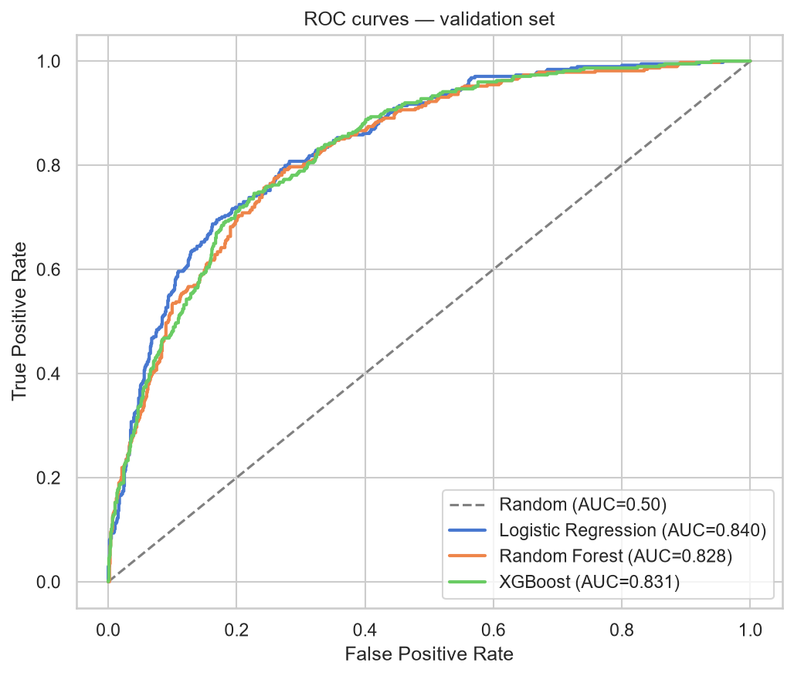
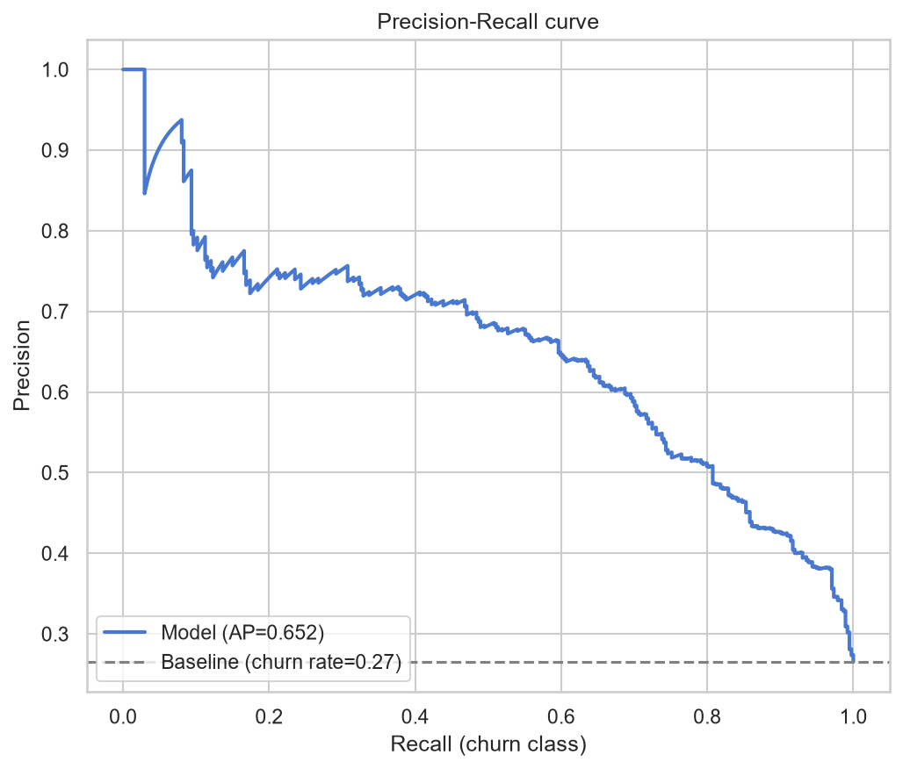
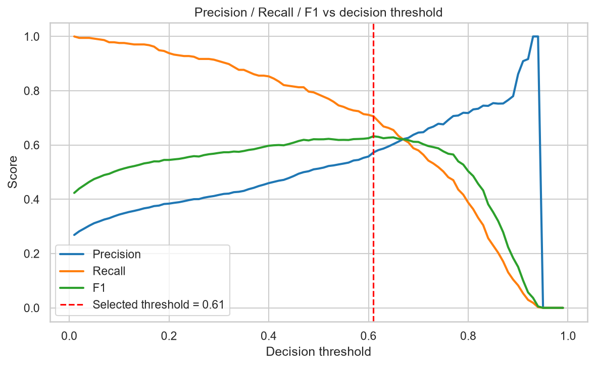
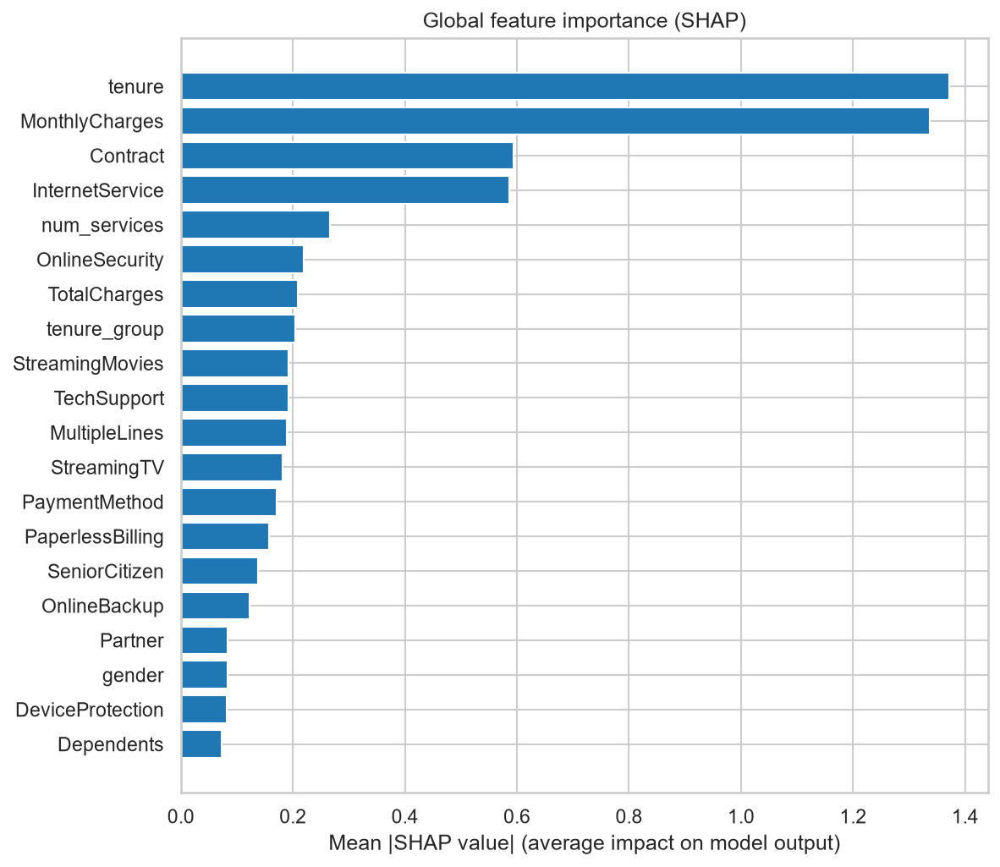
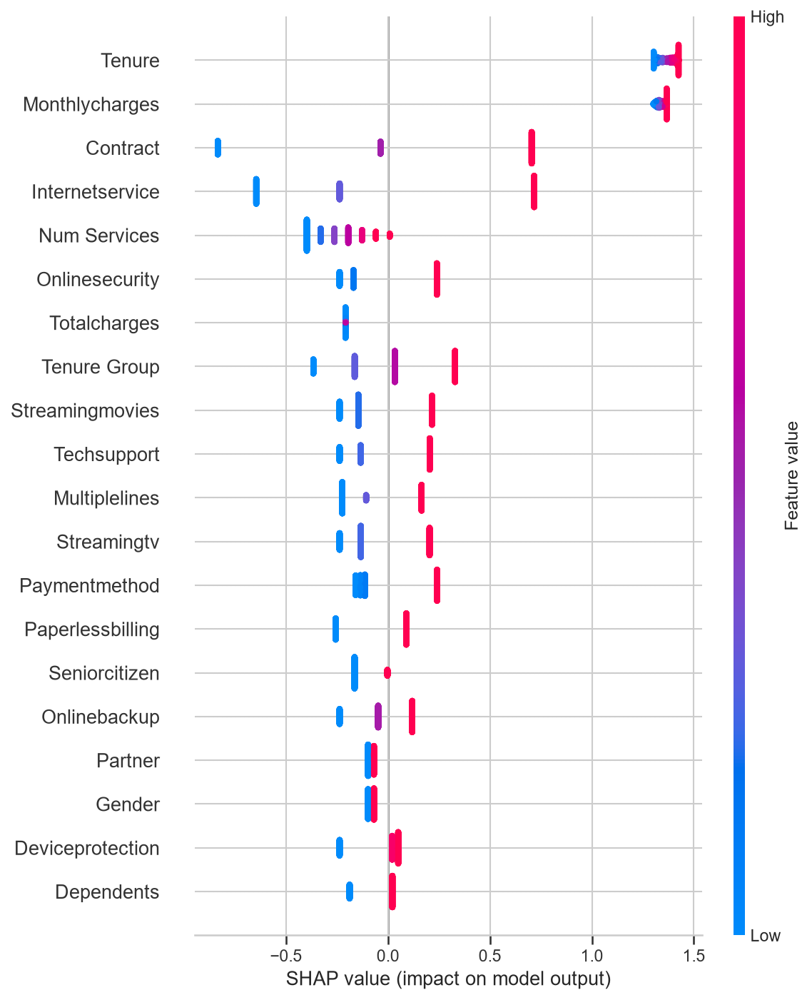

# Customer Churn Prediction

**End-to-end customer churn prediction using Python, Scikit-learn, XGBoost, SHAP and Streamlit.**

[](https://www.python.org/)
[](https://scikit-learn.org/)
[](https://xgboost.readthedocs.io/)
[](https://shap.readthedocs.io/)
[](https://streamlit.io/)
[](tests/)
[](LICENSE)

A complete, reproducible machine-learning project that predicts whether a
telecom customer is likely to churn, explains **why** with SHAP, and serves
the model through an interactive Streamlit application — covering the full
Data Science lifecycle:

**Data → Cleaning → EDA → Feature Engineering → Modelling → Evaluation → Explainability → App**

---

## Overview

Customer churn (the loss of customers to competitors) is one of the most
expensive problems in subscription businesses: acquiring a new customer
typically costs 5–25× more than retaining an existing one. This project
builds a production-style ML system that

1. scores every customer with a **churn probability**,
2. flags high-risk customers for a retention campaign,
3. explains each prediction in business terms (short tenure, month-to-month
   contract, high monthly charges, …) so account managers can act on it.

The model is a **Logistic Regression** selected among three candidates
(Logistic Regression, Random Forest, XGBoost) using cross-validation and a
documented, business-aware selection rule.

## Business Problem

> *"Which customers are about to leave, and why?"*

Given the profile of a telecom customer (tenure, contract, payment method,
services, charges), predict whether they will churn in the near future and
identify the main drivers, so the retention team can intervene before the
customer leaves.

## Objectives

- Build a **leak-free** preprocessing + modelling pipeline with
  scikit-learn `Pipeline` / `ColumnTransformer`.
- Train and honestly compare **3 models** with stratified cross-validation
  on a 60/20/20 train/validation/test split.
- Optimise the **decision threshold** for the business use-case instead of
  blindly using 0.5.
- Focus on **recall for the churn class** — missing a churner has a real
  business cost.
- Explain global and individual predictions with **SHAP**.
- Ship an interactive **Streamlit** demo and a **pytest** suite.

## Dataset

**IBM Telco Customer Churn** — 7,043 customers of a fictional telecom
company with 19 features (demographics, account, services, charges) and the
binary target `Churn` (~26.5% churners).

| | |
| --- | --- |
| Source | [IBM (official mirror)](https://github.com/IBM/telco-customer-churn-on-icp4d) · [Kaggle](https://www.kaggle.com/datasets/blastchar/telco-customer-churn) |
| Rows / columns | 7,043 × 21 |
| Target | `Churn`: `Yes` / `No` (26.5% positive) |
| Data quirks | `TotalCharges` stored as text; 11 blanks for brand-new customers (`tenure == 0`); `SeniorCitizen` stored as 0/1 |

The raw CSV is **not committed** to the repository — see
[`data/README.md`](data/README.md) for the download commands (one-liner for
Windows / macOS / Linux).

## Technologies

| Layer | Tools |
| --- | --- |
| Language | Python 3.11+ |
| Data | pandas, NumPy |
| Visualisation | Matplotlib, Seaborn, Plotly |
| Machine learning | scikit-learn (Pipeline, ColumnTransformer), XGBoost |
| Explainability | SHAP |
| Application | Streamlit |
| Testing | pytest |
| Environment | venv, requirements.txt, Git |

## Project Architecture

```
                ┌─────────────┐     ┌──────────────────┐
 raw CSV  ────► │  cleaning   │ ──► │ feature          │
(data/raw)      │ (row-wise)  │     │ engineering      │
                └─────────────┘     └──────────────────┘
                                           │
                              ┌────────────┴───────────┐
                              │ 60/20/20 stratified    │
                              │ train/val/test split   │
                              └────────────┬───────────┘
                              ┌────────────┴───────────┐
                              │ 5-fold CV: LR / RF /   │
                              │ XGBoost (class weights)│
                              └────────────┬───────────┘
                              ┌────────────┴───────────┐
                              │ selection + threshold  │
                              │ tuning + test eval     │
                              └────────────┬───────────┘
                     ┌─────────────────────┴──────────────┐
                     ▼                                    ▼
            models/churn_model.joblib             reports/figures/
            (Pipeline + threshold)                metrics, plots, SHAP
                     │                                    │
                     ▼                                    ▼
            ┌───────────────┐                   ┌────────────────┐
            │ Streamlit app │  ◄── SHAP ──────► │ README,        │
            │ (predictions  │                   │ notebooks       │
            │  + reasons)   │                   │                │
            └───────────────┘                   └────────────────┘
```

## Data Pipeline

All cleaning is **deterministic and row-wise** (no statistics learned, no
leakage) and lives in
[`src/data_preprocessing.py`](src/data_preprocessing.py):

1. empty strings → `NaN`, `TotalCharges` → numeric (coerce);
2. `SeniorCitizen` 0/1 → `No`/`Yes`;
3. duplicates dropped (none present in the raw data);
4. blank `TotalCharges` for brand-new customers (`tenure == 0`) filled with
   the current `MonthlyCharges` (a new customer has no billing history yet).

Everything that **learns from the data** runs inside a scikit-learn
`ColumnTransformer` fitted on the training set only:

| Features | Treatment |
| --- | --- |
| Numerical (`tenure`, `MonthlyCharges`, `TotalCharges`, …) | median imputation + `StandardScaler` |
| Categorical (contract, payment, services, …) | most-frequent imputation + `OneHotEncoder(handle_unknown="ignore")` |

`handle_unknown="ignore"` keeps inference robust when the app receives an
unseen category. The whole preprocessing is part of the saved pipeline, so
training and inference use exactly the same code path.

## Exploratory Data Analysis

See [`notebooks/03_eda.ipynb`](notebooks/03_eda.ipynb) — the analysis
answers concrete business questions:

| Question | Answer (from the data) |
| --- | --- |
| Which segments churn most? | Month-to-month contracts (~43% churn) vs two-year (~3%) |
| Does tenure matter? | Yes — risk collapses after the first 12 months |
| Do charges matter? | Higher monthly charges → more churn (fiber bundles) |
| Payment method? | Electronic check churns far more than automatic bank/credit card |
| Internet service? | Fiber optic churns more than DSL or no internet |






## Feature Engineering

Three business-driven features in
[`src/feature_engineering.py`](src/feature_engineering.py) — all
deterministic (row-wise), so no leakage, and each with a documented
rationale:

| Feature | Definition | Why |
| --- | --- | --- |
| `tenure_group` | 0–12 / 13–24 / 25–48 / 49+ months | tenure–churn relationship is non-linear; binning lets the linear model capture the shape |
| `num_services` | number of subscribed add-on services (0–6) | proxies "stickiness" — every extra service is a reason to stay |
| `avg_monthly_spend` | `TotalCharges / tenure` (fallback to `MonthlyCharges` for `tenure == 0`) | cleaner spending-level signal than discounted monthly charges |

Feature engineering is deliberately kept minimal — the raw Telco features
are already informative, and extra synthetic features add noise rather than
signal.

## Machine Learning Models

Three models are compared with **5-fold stratified cross-validation** on
the training set ([`src/train.py`](src/train.py)):

1. **Logistic Regression** — `class_weight="balanced"` (interpretable baseline),
2. **Random Forest** — 400 trees, balanced weights,
3. **XGBoost** — 400 trees, `scale_pos_weight` = ratio of non-churners to
   churners computed on the training fold.

**Class imbalance** (~26.5% churners) is handled with class weights and
`scale_pos_weight`. SMOTE is deliberately **not** used: with a leak-free
pipeline and well-chosen metrics, class weighting achieves the same goal
without synthetic-sample risks; it is listed as a future experiment.

### Model selection rule

The winner is **not** simply the most accurate model. The documented rule
(implemented in `select_model`) is:

1. highest mean CV **ROC-AUC**;
2. if within 0.005 → highest mean CV **F1** for the churn class;
3. final tie-break → interpretability / inference cost
   (LR > XGBoost > RF).

**Result:** Logistic Regression wins — it also happens to be the most
interpretable and cheapest option to serve.

## Model Evaluation

Accuracy alone is misleading here (a "predict no churn for everyone" model
already scores ~73.5%). The metrics that matter:

- **Recall (churn)** — share of real churners we catch. Missing a churner
  costs the company a customer. The priority metric.
- **Precision** — share of flagged customers who really churn. Keeps the
  retention campaign budget from being wasted.
- **F1** — the harmonic balance between the two.
- **ROC-AUC** — ranking quality across all thresholds.

### Cross-validation (5-fold, mean ± std)

| Model | ROC-AUC | Precision | Recall | F1 |
| ----- | ------- | --------- | ------ | -- |
| **Logistic Regression** ✅ | **0.8485 ± 0.0126** | 0.5328 | **0.8011** | **0.6301** |
| Random Forest | 0.8404 ± 0.0121 | 0.5699 | 0.7101 | 0.6276 |
| XGBoost | 0.8381 ± 0.0101 | 0.5534 | 0.7413 | 0.6265 |

### Decision threshold

A raw 0.5 threshold is not optimal for churn. The threshold is tuned on the
**validation set** to maximise F1 → **0.61** (`THRESHOLD_METRIC` in
`src/config.py` can be switched to `recall` if the business prefers
catching more churners).

### Held-out test set (1,409 customers, never used during training)

| Threshold | Accuracy | Precision | Recall | F1 | ROC-AUC |
| --------- | -------- | --------- | ------ | -- | ------- |
| 0.50 | 0.7331 | 0.4983 | 0.7914 | 0.6116 | 0.8420 |
| **0.61 (tuned)** | **0.7757** | **0.5620** | **0.7032** | **0.6247** | **0.8420** |






## Explainable AI

Global and local explanations are produced with **SHAP** (for the linear
final model, the mathematically equivalent exact coefficient decomposition
is used, mapped back to the original features).

* **Global importance** — which features matter on average:
  
* **Summary (beeswarm)** — how each feature value pushes the prediction:
  
* **Individual** — every prediction in the app comes with its own
  waterfall, e.g. *"high churn risk because: tenure = 3 (+), monthly
  charges = 89.5 (+), fiber optic (+), month-to-month contract (+)"*.

The typical high-risk profile the model learns: **new customer, fiber
optic, month-to-month contract, electronic check, no online security**.

## Streamlit Demo

An interactive demo app
([`app/app.py`](app/app.py)) lets you type a customer profile and get:

- a **HIGH / LOW churn risk** verdict (using the tuned threshold),
- the **churn probability** (gauge) and prediction **confidence**,
- the **key drivers** of the prediction (top SHAP contributions),
- a **SHAP waterfall** showing each feature's impact on the probability,
- the model's test metrics and selection rule.

```bash
streamlit run app/app.py
```

The app reuses the exact same pipeline as training (`models/churn_model.joblib`),
so predictions shown in the UI are identical to `src.predict` outputs.

## Results

| | |
| --- | --- |
| Final model | Logistic Regression (balanced class weights) |
| Selected via | 5-fold CV ROC-AUC (0.8485) + F1 tie-break + interpretability |
| Decision threshold | 0.61 (F1-optimal on validation) |
| Test ROC-AUC | **0.8420** |
| Test recall (churn) | **0.7032** @ tuned threshold (0.7914 @ 0.5) |
| Test precision | 0.5620 @ tuned threshold |
| Test F1 | 0.6247 @ tuned threshold |
| Explainability | SHAP global + per-prediction explanations |

Full numeric breakdowns are in
[`reports/model_comparison.csv`](reports/model_comparison.csv) and
[`models/metrics.json`](models/metrics.json).

## Installation

```bash
# 1. clone the repository
git clone https://github.com/<your-username>/customer-churn-prediction.git
cd customer-churn-prediction

# 2. create and activate a virtual environment
python -m venv .venv
.venv\Scripts\activate          # Windows
# source .venv/bin/activate     # macOS / Linux

# 3. install the dependencies
pip install -r requirements.txt

# 4. download the dataset (see data/README.md for details)
# Windows (PowerShell):
New-Item -ItemType Directory -Force -Path data\raw | Out-Null
Invoke-WebRequest -Uri "https://raw.githubusercontent.com/IBM/telco-customer-churn-on-icp4d/master/data/Telco-Customer-Churn.csv" -OutFile "data\raw\Telco-Customer-Churn.csv"
```

## Usage

```bash
# train the pipeline end-to-end (cleaning -> CV -> selection -> threshold ->
# test evaluation -> SHAP -> artefacts)                       ~3 minutes
python -m src.train

# quick prediction + explanation for a sample customer
python -m src.predict

# run the unit tests (34 tests)
pytest

# launch the interactive demo
streamlit run app/app.py

# (re)build and execute the notebooks with real outputs
python scripts/build_notebooks.py
```

## Project Structure

```
customer-churn-prediction/
├── data/
│   ├── raw/                      <- raw CSV (NOT committed, see data/README.md)
│   ├── processed/                <- train/test splits with features (generated)
│   └── README.md                 <- dataset source + download commands
├── notebooks/                    <- executed notebooks (exploration -> modelling)
│   ├── 01_data_exploration.ipynb
│   ├── 02_data_cleaning.ipynb
│   ├── 03_eda.ipynb
│   └── 04_modeling.ipynb
├── src/
│   ├── config.py                 <- paths + experiment constants
│   ├── data_preprocessing.py     <- cleaning + leak-free ColumnTransformer
│   ├── feature_engineering.py    <- tenure groups, service count, avg spend
│   ├── train.py                  <- CV, selection, threshold tuning, artefacts
│   ├── evaluate.py               <- metrics + diagnostic plots
│   └── predict.py                <- loading, prediction, SHAP explanations
├── models/
│   ├── churn_model.joblib        <- trained pipeline + threshold + metadata
│   └── metrics.json              <- full evaluation report
├── app/
│   └── app.py                    <- Streamlit demo
├── tests/                        <- pytest suite (34 tests)
├── scripts/
│   └── build_notebooks.py        <- (re)builds + executes the notebooks
├── reports/
│   ├── figures/                  <- EDA, evaluation and SHAP figures
│   └── model_comparison.csv      <- CV comparison table
├── requirements.txt
├── .gitignore
├── LICENSE
└── README.md
```

## Future Improvements

- Hyperparameter tuning (e.g. `RandomizedSearchCV` / Optuna) for the tree models.
- Experiment with SMOTE/ADASYN inside the cross-validation loop and compare
  against class weighting.
- Cost-sensitive evaluation: attach a real €/$ cost to false negatives vs
  false positives and tune the threshold on expected savings.
- Add a small FastAPI endpoint serving the same pipeline.
- Calibrate probabilities (isotonic/Platt) for decision-making.
- CI pipeline (GitHub Actions) running `pytest` on every push.
- SQL-based feature store demo (the spec allows SQL/SQLite) and drift
  monitoring on live features.

## Author

**Ouissal Nari** — Data Scientist in training, looking for Data Science /
Data & AI internships and PFE opportunities.

* [GitHub](https://github.com/ouissal-nari)
* [LinkedIn](https://www.linkedin.com/) *(add your profile URL)*

---

*This project was built as a portfolio piece to demonstrate the complete
machine-learning lifecycle: data preparation, EDA, feature engineering,
model comparison, evaluation, explainability, application and testing.*

