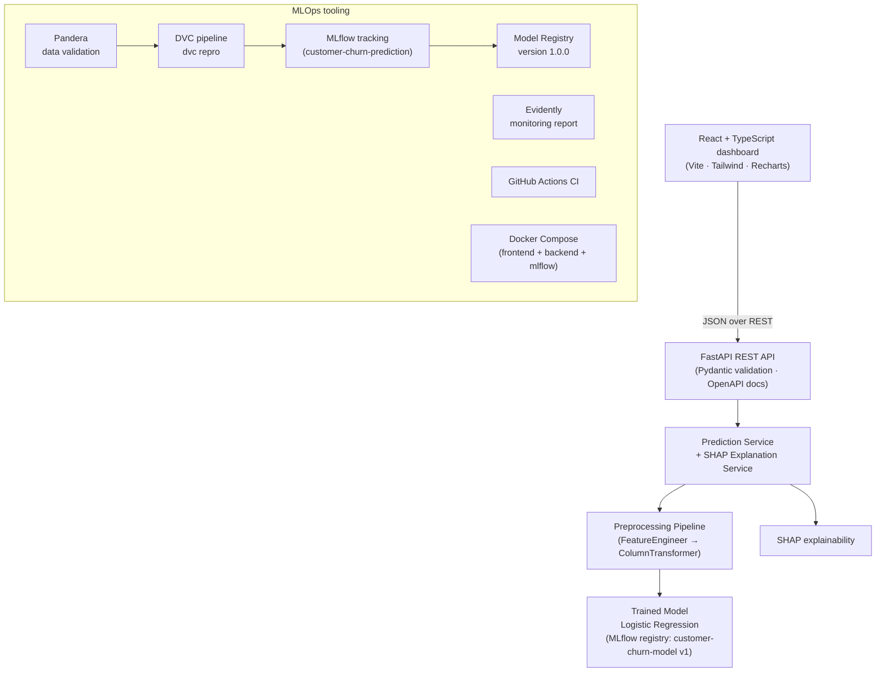

# Customer Churn Prediction — End-to-End ML Platform

**An end-to-end machine learning platform that predicts customer churn, explains every prediction, and serves the model through a professional web application — covering the full MLOps lifecycle.**

[](https://www.python.org/)
[](https://fastapi.tiangolo.com/)
[](https://react.dev/)
[](https://mlflow.org/)
[](https://dvc.org/)
[](tests/)
[](LICENSE)

---

## Overview

Customer churn — customers leaving for a competitor — is one of the most
expensive problems in subscription businesses: acquiring a new customer
typically costs 5–25× more than retaining an existing one. This project
builds a production-style ML system that

1. scores every customer with a **churn probability**,
2. flags **high-risk customers** for a retention campaign,
3. **explains each prediction** in business terms (short tenure,
   month-to-month contract, high monthly charges, …) so account managers can
   act on it,
4. serves everything through a **FastAPI REST API** and a **React
   dashboard**,
5. manages the model lifecycle with **MLflow** (experiments + registry),
   **DVC** (data & pipeline versioning) and **Evidently** (monitoring).

## Business Objective

> *"Which customers are about to leave, and why?"*

Given the profile of a telecom customer (tenure, contract, payment method,
services, charges), predict whether they will churn in the near future and
identify the main drivers, so the retention team can intervene **before**
the customer leaves. The key business metric is **recall for the churn
class** — missing a churner has a real cost, so the decision threshold is
tuned on the validation set instead of being fixed at 0.5.

## Architecture



**Flow:** React frontend → FastAPI → Prediction Service → preprocessing
pipeline → trained model → prediction + probability + SHAP explanation.
The frontend never touches the ML model directly — every call goes through
the REST API. Around the model: data validation, experiment tracking, model
versioning, monitoring, CI/CD and containerisation.

## Dataset

**IBM Telco Customer Churn** — 7,043 customers of a fictional telecom
company with 19 features (demographics, account, services, charges) and the
binary target `Churn` (~26.5% churners).

| | |
| --- | --- |
| Source | [IBM (official mirror)](https://github.com/IBM/telco-customer-churn-on-icp4d) · [Kaggle](https://www.kaggle.com/datasets/blastchar/telco-customer-churn) |
| Rows / columns | 7,043 × 21 |
| Target | `Churn`: `Yes` / `No` (26.5% positive) |
| Data quirks | `TotalCharges` stored as text; 11 blanks for brand-new customers (`tenure == 0`); `SeniorCitizen` stored as 0/1 |


## Machine Learning

### Preprocessing

* **Data validation first** — the raw CSV is checked with a **Pandera**
  schema (columns, dtypes, allowed categories, ranges, missing-value rules,
  duplicates). Invalid data stops training with a readable error.
* **Deterministic cleaning** — blank `TotalCharges` filled for brand-new
  customers, `SeniorCitizen` mapped to Yes/No, duplicates dropped. Only
  row-wise business rules are used, so nothing can leak between splits.
* **Leak-free `ColumnTransformer`** — numerical features go through median
  imputation + `StandardScaler`; categorical features through most-frequent
  imputation + one-hot encoding (`handle_unknown="ignore"`). Every statistic
  is learned **on training data only**.

### Feature engineering

Three business-driven, row-wise features (no learned statistics):

| Feature | Why |
| --- | --- |
| `tenure_group` | churn risk collapses after 1–2 years — binning lets linear models capture that |
| `num_services` | number of add-on services = "customer stickiness" |
| `avg_monthly_spend` | `TotalCharges / tenure` — cleaner spending level than discounted monthly charges |

### Models & cross-validation

Three candidates are compared with **5-fold stratified cross-validation**
on a 60/20/20 train/validation/test split:

* **Logistic Regression** — `class_weight="balanced"`
* **Random Forest** — 400 trees, balanced weights
* **XGBoost** — 400 trees, `scale_pos_weight`

Class imbalance (~26.5% churners) is handled with class weights /
`scale_pos_weight`; SMOTE is deliberately not used (see [docs/architecture.md](docs/architecture.md)).

Selection rule: **highest mean CV ROC-AUC**, F1 tie-break within 0.005, then
interpretability (Logistic Regression wins).

### Threshold tuning

The decision threshold is grid-searched on the **validation set** to
maximise F1 for the churn class → **0.61** (not 0.50). Recall matters most:
missing a churner costs more than calling a loyal customer.

## Results

Real metrics from the hold-out test set (1,409 customers), reproduced
exactly by the DVC pipeline:

| Model | CV ROC-AUC | CV F1 | CV Recall | CV Precision |
| --- | --- | --- | --- | --- |
| **Logistic Regression** ✅ | **0.8485 ± 0.013** | **0.6301** | **0.8011** | 0.5194 |
| Random Forest | 0.8404 ± 0.012 | 0.6276 | 0.7101 | 0.5628 |
| XGBoost | 0.8381 ± 0.010 | 0.6265 | 0.7413 | 0.5432 |

**Test set — Logistic Regression:**

| Threshold | Accuracy | Precision | Recall | F1 | ROC-AUC |
| --- | --- | --- | --- | --- | --- |
| 0.50 | 0.7331 | 0.4983 | 0.7914 | 0.6116 | 0.8420 |
| **0.61 (tuned)** | **0.7757** | **0.5620** | **0.7032** | **0.6247** | **0.8420** |

Confusion matrix at the tuned threshold: TP = 263, FP = 205, FN = 111,
TN = 830 (the report figures live in `reports/figures/`).

## Explainability

Every prediction is explained with **SHAP** (model-agnostic game-theory
feature attributions):

* **Global** — mean |SHAP| importance and a beeswarm summary
  (`reports/figures/shap_importance.png`, `shap_summary.png`).
* **Local** — per prediction, contributions are aggregated back to the
  original business features (one-hot columns are summed), so the API
  returns drivers like *"Contract = Month-to-month increases churn risk
  (+6.2 pp)"* instead of opaque encoded columns.
* For Logistic Regression, exact coefficient-based contributions are used;
  for tree models, `shap.TreeExplainer`.

## MLOps

| Tool | Role |
| --- | --- |
| **MLflow** | Experiment tracking (`customer-churn-prediction`: 3 candidate runs + final run, each with hyperparameters, CV metrics, training duration and artefacts) and the **Model Registry** (`customer-churn-model` v1, version reported by the API). |
| **DVC** | Data & artefact versioning (raw CSV, trained model, processed splits) + reproducible pipeline (`dvc repro`: validate → train). No external remote is configured — the local cache is the source of truth (see [models/README.md](models/README.md)). |
| **Pandera** | Data validation before training (required columns, dtypes, categories, ranges, missing values, duplicates). |
| **Evidently** | [Monitoring report](monitoring/README.md) comparing the training window with simulated recent traffic (data quality, feature/target/prediction drift). Clearly labelled as a **simulated** scenario. |
| **Docker** | `docker-compose.yml` runs frontend (nginx), backend (uvicorn) and MLflow with health checks; multi-stage frontend build. |
| **GitHub Actions** | CI on every push/PR: ruff lint, 92 tests + coverage, structure validation, Docker image builds. Deployment is **not** configured (see Limitations). |

The raw CSV is **not committed to Git** — it is versioned with **DVC**
(`data/raw/Telco-Customer-Churn.csv.dvc`). See [`data/README.md`](data/README.md)
for the download commands.

## API

FastAPI application with automatic OpenAPI docs at `http://localhost:8000/docs`.

| Method | Endpoint | Description |
| --- | --- | --- |
| `GET` | `/api/health` | Liveness probe: API status + model loaded + version |
| `GET` | `/api/model/info` | Model name, version, training date, threshold, feature count, test metrics, MLflow run id |
| `POST` | `/api/predict` | Score one customer + SHAP explanation |
| `POST` | `/api/predict/batch` | Upload a CSV, get scored rows back (`?format=csv` for a downloadable CSV) |
| `GET` | `/api/dashboard/summary` | Dashboard KPIs and chart data (computed on the hold-out test set) |
| `GET` | `/api/dashboard/drivers` | Global SHAP feature importance |

**`POST /api/predict` response:**

```json
{
  "prediction": "CHURN",
  "probability": 0.921,
  "risk_level": "HIGH",
  "confidence": 0.921,
  "threshold": 0.61,
  "model_version": "1.0.0",
  "top_drivers": [
    {"feature": "tenure", "value": 3, "impact": "increases churn risk", "probability_shift": 0.133},
    {"feature": "Contract", "value": "Month-to-month", "impact": "increases churn risk", "probability_shift": 0.062}
  ],
  "explanation": "The customer has a 92% churn probability. The strongest driver is tenure = 3, which increases churn risk."
}
```

Risk bands (business rule, independent of the decision threshold): `LOW` < 40%,
`MEDIUM` 40–70%, `HIGH` > 70%. Invalid input is rejected with a structured
`422`, batch errors with `400`, oversized files with `413`, missing model
with `503`.

## Frontend

A professional React + TypeScript dashboard (Vite, Tailwind CSS, Recharts):

* **Dashboard** — total customers, predicted churn rate, high-risk count,
  average probability, model version; churn/risk/probability distributions
  and top churn drivers (all computed server-side from the hold-out test
  set).
* **Customer Prediction** — full customer form (validated by the API),
  CHURN/NO-CHURN banner with probability, risk, confidence, model version,
  top contributing factors and a waterfall chart.
* **Model Information** — model name, version, training date, ROC-AUC,
  precision, recall, F1, threshold, feature count, registry metadata.
* **Batch Prediction** — CSV upload → scored table + automatic download of
  the enriched CSV.

> Screenshots are intentionally not included: this repository contains only
> what was actually generated and tested. Run the frontend (commands below)
> to see it.

## Installation

```bash
# 1. clone
git clone https://github.com/oouissal/customer-churn-prediction.git
cd customer-churn-prediction

# 2. virtual environment
python -m venv .venv
# Windows (PowerShell):
.venv\Scripts\Activate.ps1
# macOS / Linux:
# source .venv/bin/activate

# 3. dependencies
pip install -r requirements.txt

# 4. dataset (see data/README.md for details) — Windows PowerShell:
New-Item -ItemType Directory -Force -Path data\raw | Out-Null
Invoke-WebRequest -Uri "https://raw.githubusercontent.com/IBM/telco-customer-churn-on-icp4d/master/data/Telco-Customer-Churn.csv" -OutFile "data\raw\Telco-Customer-Churn.csv"
```

## Reproducing the pipeline (DVC)

```bash
dvc repro        # validate raw data -> train -> evaluate -> MLflow registry
dvc metrics show # inspect tracked metrics
```

`dvc repro` only re-runs stages whose inputs changed; the whole pipeline
from the raw CSV takes ~1 minute.

## Docker

```bash
docker compose up --build
```

| Service | URL | Notes |
| --- | --- | --- |
| Frontend | http://localhost:8080 | nginx serves the built React app |
| Backend | http://localhost:8000 | FastAPI + Swagger at `/docs` |
| MLflow UI | http://localhost:5000 | shared tracking store (`./mlruns` volume) |

Health checks are defined for all three services. The images do **not**
contain the dataset, `.venv` or caches.

## Local Development

### Backend

```bash
uvicorn app.main:app --app-dir backend --reload --port 8000
# Swagger UI: http://localhost:8000/docs
```

### Frontend

```bash
cd frontend
npm install
npm run dev          # http://localhost:5173 (proxies /api -> :8000)
```

### MLflow UI

```bash
mlflow ui --backend-store-uri sqlite:///mlruns/mlflow.db --port 5000
# http://localhost:5000
```

## Testing

```bash
pytest                          # full suite (92 tests: unit + API)
pytest --cov=src --cov=backend  # coverage report
ruff check src backend tests monitoring scripts   # lint
cd frontend && npm run build && npm run lint      # frontend build + lint
```


## Project Architecture

```
customer-churn-prediction/
├── backend/                     <- FastAPI application
│   ├── app/
│   │   ├── main.py              <- app factory, CORS, error handling
│   │   ├── core/config.py       <- environment-driven settings
│   │   ├── api/                 <- routes, Pydantic schemas, dependencies
│   │   └── services/            <- model / prediction / explanation / dashboard
│   ├── tests/                   <- API test suite (httpx TestClient)
│   ├── requirements.txt
│   └── Dockerfile
├── frontend/                    <- React + TypeScript + Vite + Tailwind + Recharts
│   ├── src/pages/               <- Dashboard, Predict, Model, Batch
│   ├── src/api/                 <- typed API client (no ML logic)
│   ├── nginx.conf               <- SPA serving + /api proxy
│   └── Dockerfile               <- multi-stage build
├── src/                         <- ML package (shared by training + API)
│   ├── config.py                <- paths + experiment constants
│   ├── validation.py            <- Pandera raw-data schema
│   ├── data_preprocessing.py    <- cleaning + leak-free ColumnTransformer
│   ├── feature_engineering.py   <- tenure_group, num_services, avg_monthly_spend
│   ├── train.py                 <- validation -> CV -> MLflow -> selection -> tuning
│   ├── evaluate.py              <- metrics + diagnostic plots
│   └── predict.py               <- inference + SHAP explanations
├── monitoring/                  <- Evidently report (simulated scenario)
├── notebooks/                   <- executed EDA & modelling notebooks
├── data/                        <- raw (DVC) + processed (DVC) + README
├── models/                      <- trained artefacts (DVC) + registry docs
├── mlruns/                      <- local MLflow store (git-ignored)
├── docs/architecture.md         <- WHY each technology was chosen
├── dvc.yaml / dvc.lock          <- reproducible DVC pipeline
├── docker-compose.yml           <- frontend + backend + mlflow
├── .github/workflows/ci.yml     <- lint / test / structure / docker build
├── pyproject.toml               <- project metadata + ruff + pytest config
├── .env.example                 <- documented environment variables
└── README.md
```

## Limitations

* **Single dataset, no live production system.** Everything runs locally;
  there is no cloud deployment, no real-time stream and no real monitoring
  traffic — the monitoring module is an honest, reproducible **simulation**
  using the hold-out test set.
* **No external DVC remote** — artefacts live in the local DVC cache; a
  remote (S3/GCS/…) must be added to share them across machines.
* **No authentication** — the API is demo-scoped and not exposed publicly.
* **No hyperparameter tuning** — the three candidates use fixed, documented
  hyperparameters; tuning is a listed future experiment.
* **Single model type in production** — the registry contains the selected
  Logistic Regression; the API currently serves the artefact file, and
  loading models directly from the MLflow registry server is a documented
  follow-up.
* **Simulated lifecycle stages** — Development → Validation → Production is
  documented as a process; nothing pretends to be a real promotion workflow.

## Future Improvements

* Cloud deployment (e.g. a managed VM/container service) with a real DVC
  remote and a hosted MLflow server.
* Automated retraining triggered on drift alerts from the Evidently report.
* Hyperparameter tuning (Optuna / RandomizedSearchCV) tracked in MLflow.
* Probability calibration (isotonic/Platt) for decision-making.
* Serving the model directly from the MLflow registry (staging/production
  aliases) instead of the local artefact file.
* Real-time scoring with a streaming pipeline if a live event source exists.
* Kubernetes once multi-service scaling becomes an actual requirement.

## Author

**Ouissal Nari** — Data Scientist in training, looking for Data Science /
Data & AI internships and PFE opportunities.

* [GitHub](https://github.com/oouissal)
* [LinkedIn](https://www.linkedin.com/)

---

*Built as a portfolio piece demonstrating the complete machine-learning
lifecycle: data validation, EDA, feature engineering, model comparison,
evaluation, explainability, API development, experiment tracking, model
versioning, monitoring, containerisation and CI.*

